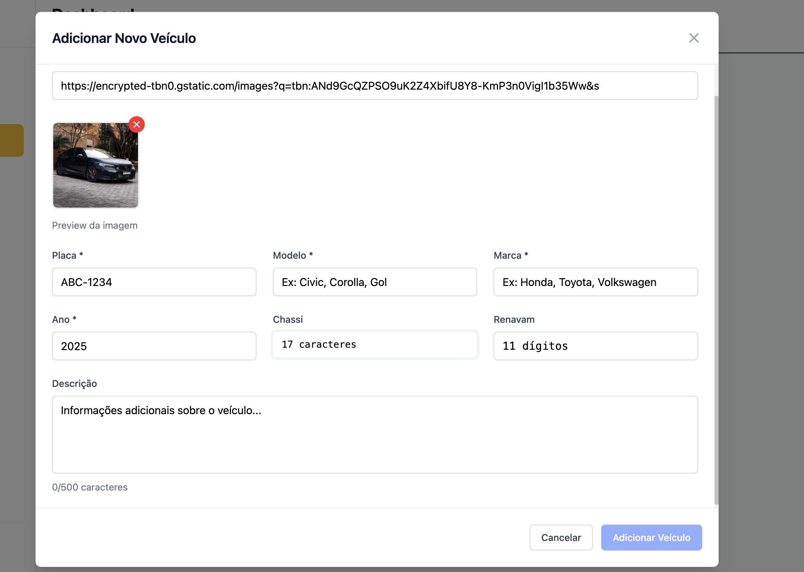
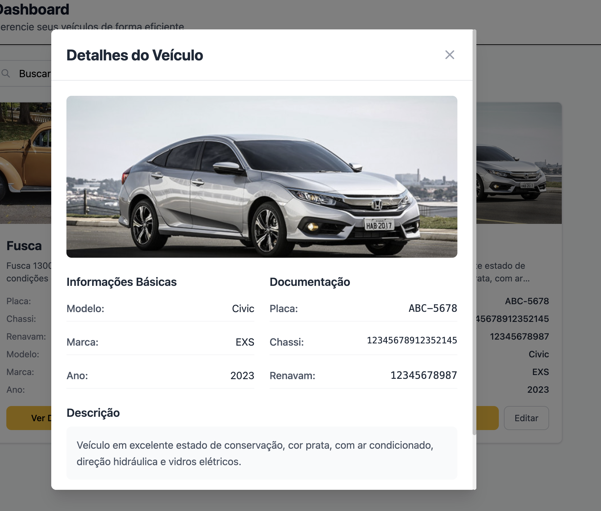
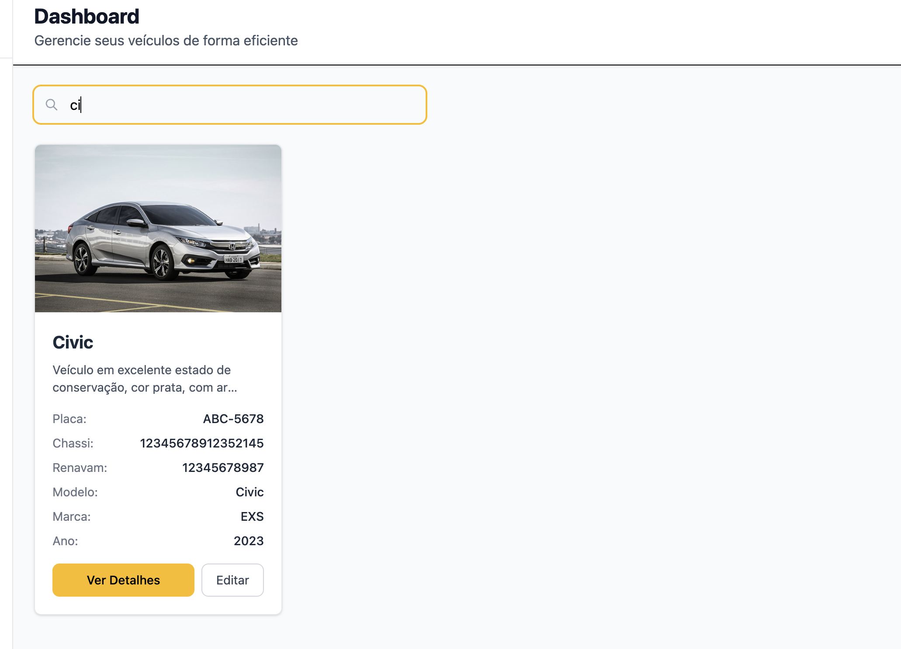
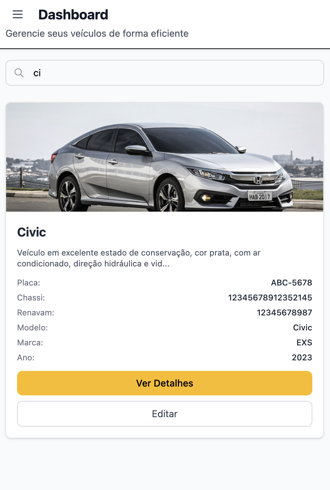

# 🚗 Carros Info - Sistema de Gerenciamento de Veículos

Um sistema web moderno e responsivo para gerenciamento de veículos, desenvolvido com Angular 19 e TailwindCSS.

## 📋 Índice

- [Sobre o Projeto](#sobre-o-projeto)
- [Funcionalidades](#funcionalidades)
- [Tecnologias Utilizadas](#tecnologias-utilizadas)
- [Pré-requisitos](#pré-requisitos)
- [Instalação](#instalação)
- [Como Usar](#como-usar)
- [Screenshots](#screenshots)
- [Estrutura do Projeto](#estrutura-do-projeto)
- [API Endpoints](#api-endpoints)
- [Contribuição](#contribuição)
- [Licença](#licença)

## 🎯 Sobre o Projeto

O **Carros Info** é uma aplicação web completa para gerenciamento de veículos que permite aos usuários cadastrar, visualizar, editar, buscar e remover informações de veículos de forma intuitiva e eficiente.

## ✨ Funcionalidades

### 🔐 Autenticação

- Sistema de login seguro
- Proteção de rotas com guards
- Gerenciamento de sessão
- Logout com limpeza de dados

### 🚙 Gerenciamento de Veículos

- **Cadastro de Veículos**: Adicione novos veículos com informações completas
- **Visualização Detalhada**: Veja todos os detalhes de um veículo em modal
- **Edição**: Atualize informações de veículos existentes
- **Remoção**: Exclua veículos com confirmação de segurança
- **Busca Inteligente**: Pesquise por modelo, marca ou placa
- **Upload de Fotos**: Adicione imagens dos veículos via URL

### 🎨 Interface e Experiência

- **Design Responsivo**: Funciona perfeitamente em desktop, tablet e mobile
- **Sidebar Navegável**: Menu lateral com navegação intuitiva
- **Notificações**: Feedback visual para todas as ações
- **Loading States**: Indicadores de carregamento para melhor UX
- **Modais Interativos**: Interface limpa para visualização e edição

### 📱 Recursos Mobile

- Menu hambúrguer para dispositivos móveis
- Overlay para fechamento do menu
- Layout adaptativo para diferentes tamanhos de tela
- Touch-friendly interface

## 🛠 Tecnologias Utilizadas

### Frontend

- **Angular 19** - Framework principal
- **TypeScript** - Linguagem de programação
- **TailwindCSS 4** - Framework CSS utilitário
- **Angular CDK** - Componentes e utilitários
- **RxJS** - Programação reativa

### Bibliotecas e Ferramentas

- **ngx-toastr** - Notificações toast
- **Angular Forms** - Formulários reativos
- **Angular Router** - Roteamento
- **PostCSS** - Processamento CSS
- **ESLint + Prettier** - Linting e formatação

### Desenvolvimento

- **Angular CLI** - Ferramenta de desenvolvimento
- **Karma + Jasmine** - Testes unitários
- **TypeScript 5.7** - Compilação

## 📋 Pré-requisitos

Antes de começar, certifique-se de ter instalado:

- **Node.js** (versão 18 ou superior)
- **npm** (versão 9 ou superior)
- **Angular CLI** (versão 19 ou superior)

```bash
# Verificar versões instaladas
node --version
npm --version
ng version
```

## 🚀 Instalação

1. **Clone o repositório**

```bash
git clone <url-do-repositorio>
cd projeto-web
```

2. **Instale as dependências**

```bash
npm install
```

3. **Configure o ambiente**

```bash
# Copie o arquivo de ambiente (se necessário)
cp src/environments/environments.example.ts src/environments/environments.ts
```

4. **Inicie o servidor de desenvolvimento**

```bash
npm start
# ou
ng serve
```

5. **Acesse a aplicação**
   - Abra seu navegador e vá para `http://localhost:4200`

## 📖 Como Usar

### 1. Login

- Acesse a página inicial
- Faça login com suas credenciais
- Será redirecionado para o dashboard

### 2. Gerenciar Veículos

#### Adicionar Veículo

1. Clique em "Adicionar Carro" na sidebar
2. Preencha o formulário com:
   - **Placa\*** (obrigatório)
   - **Modelo\*** (obrigatório)
   - **Marca\*** (obrigatório)
   - **Ano\*** (obrigatório)
   - **Chassi** (17 caracteres)
   - **Renavam** (11 dígitos)
   - **Descrição** (até 500 caracteres)
   - **URL da Foto**
3. Clique em "Salvar"

#### Buscar Veículos

1. Use a barra de busca no topo da página
2. Digite modelo, marca ou placa
3. Os resultados são filtrados em tempo real

#### Visualizar Detalhes

1. Clique em qualquer card de veículo
2. Veja todas as informações em um modal
3. Opções para editar ou remover

#### Editar Veículo

1. Clique no veículo desejado
2. Clique em "Editar" no modal
3. Modifique as informações
4. Salve as alterações

#### Remover Veículo

1. Clique no veículo desejado
2. Clique em "Remover" no modal
3. Confirme a ação

### 3. Logout

- Clique em "Logout" na parte inferior da sidebar
- Será redirecionado para a página de login

## 📸 Screenshots

> **Nota**: Adicione suas capturas de tela na pasta `screenshots/` e referencie-as aqui.

### Dashboard Principal


_Visão geral do dashboard com lista de veículos_

### Formulário de Cadastro


_Modal para adicionar/editar veículos_

### Detalhes do Veículo


_Modal com informações detalhadas do veículo_

### Busca de Veículos


_Funcionalidade de busca em tempo real_

### Versão Mobile


_Interface responsiva para dispositivos móveis_

## 📁 Estrutura do Projeto

```
src/
├── app/
│   ├── components/          # Componentes reutilizáveis
│   │   ├── sidebar/         # Menu lateral
│   │   ├── card/           # Card de veículo
│   │   ├── add-vehicle-modal/  # Modal de cadastro/edição
│   │   └── vehicle-detail-modal/  # Modal de detalhes
│   ├── core/               # Serviços e utilitários
│   │   ├── DTO/            # Interfaces e tipos
│   │   ├── guards/         # Guards de rota
│   │   └── services/       # Serviços da aplicação
│   ├── modules/            # Módulos da aplicação
│   │   └── pages/          # Páginas principais
│   │       ├── home/       # Dashboard principal
│   │       └── auth/       # Autenticação
│   ├── app.component.*     # Componente raiz
│   ├── app.config.ts       # Configuração da aplicação
│   └── app.routes.ts       # Definição de rotas
├── environments/           # Configurações de ambiente
├── styles.css             # Estilos globais
└── main.ts               # Ponto de entrada
```

## 🔌 API Endpoints

A aplicação consome os seguintes endpoints:

### Veículos

- `GET /vehicles` - Lista veículos com paginação
- `GET /vehicles/:id` - Busca veículo por ID
- `POST /vehicles` - Cria novo veículo
- `PUT /vehicles/:id` - Atualiza veículo
- `DELETE /vehicles/:id` - Remove veículo

### Parâmetros de Query

- `page` - Número da página (padrão: 1)
- `limit` - Itens por página (padrão: 10)

## 🧪 Testes

### Executar Testes Unitários

```bash
npm test
# ou
ng test
```

### Executar Testes E2E

```bash
npm run e2e
# ou
ng e2e
```

## 🏗 Build

### Build de Desenvolvimento

```bash
npm run build
# ou
ng build
```

### Build de Produção

```bash
npm run build -- --configuration production
# ou
ng build --configuration production
```

Os arquivos de build serão gerados no diretório `dist/`.

## 🤝 Contribuição

1. Faça um fork do projeto
2. Crie uma branch para sua feature (`git checkout -b feature/AmazingFeature`)
3. Commit suas mudanças (`git commit -m 'Add some AmazingFeature'`)
4. Push para a branch (`git push origin feature/AmazingFeature`)
5. Abra um Pull Request

### Padrões de Código

- Use **ESLint** e **Prettier** para formatação
- Siga as convenções do **Angular Style Guide**
- Escreva testes para novas funcionalidades
- Documente mudanças significativas

⭐ **Desenvolvido com Angular 19 e TailwindCSS** ⭐
